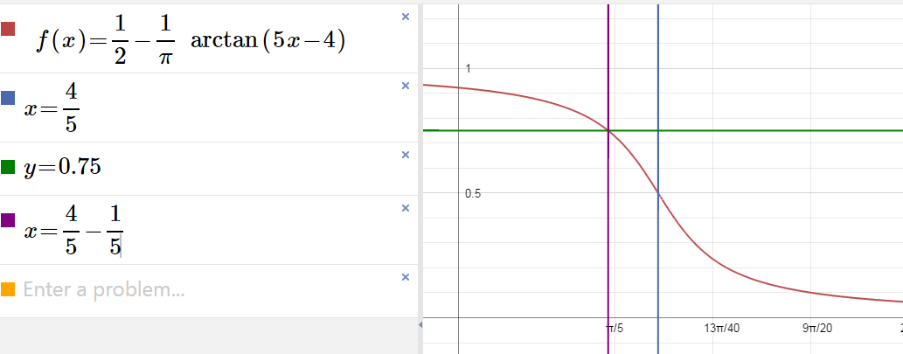

# 关于时间衰减算法。

## 场景说明

在制作Sekai's Secret GardeN时发现一个问题，第一个版本的搜索是十分简单的，逻辑大致如下：

1. 前端判断搜索词长度等规范，合理则编码传入。
2. 后端对番号、标题、标签、演员等字段进行模糊匹配。
3. 返回前N个。

这个逻辑存在很大问题，首先mongodb返回时默认按照_id排序，所以经常返回一个作品有大量演员并且发行时间与排序无关。

所以改进了一下搜索策略，对上面的2阶段进行重新设计，采用聚合管道如下：

1. 对番号、标题、标签、演员等字段进行模糊匹配。
2. 过滤一些字段，并加入ActressCount表示每个候选项的演员个数。
3. 按照ActressCount正序和发行时间逆序排序。

这时候返回的结果中，演员数为1的都在最上面，且按照发行时间逆序分布，然而这时候有个问题，发行时间靠前的演员数为2的影片一定会在演员数为1的所有影片之后，不管这个影片多早发行，这是不符合期望的，所以有必要引入时间衰减。

## 时间衰减

对于视频、书籍等文化产品，时间是一个很重要的重要性指标，然而这些产品和水果蔬菜不一样，并不总是越新鲜越好，也不是慢慢变得劣质，理论上这些产品拥有一个“绽放期”，也就是说从产品出产的一段时间内，都为这个产品的“黄金时段”，过了这个时间，产品的品质就会迅速下降，再过一段时间，产品的品质趋于稳定，这个稳定值应该算是产品本身的价值。

在搜索中，产品品质和最终得分息息相关。在Sekai's Secret GardeN中，产品品质受演员人数影响最大，也就是说我们可以近似看演员人数为产品本身的价值，即演员越多，品质越低劣，同时要考虑到以发行时间为衰减的函数，获得其中关系就能得到产品当前的品质，这个品质近似看做当前搜索的得分。

## 衰减函数原型

在选取时间函数时，我考虑了这么几点：

1. 首先不在乎函数定义域和值域，这些可以在后面用初等变换抵消。
2. 函数在区域无穷时需要收敛。
3. 函数值（或者其导数值）有且只有一个迅速衰减/增加的过程。
4. 计算需要足够简单（使用javascript）。

以下是我选取的几个函数用来测试。

### arccot函数


```
f(x) = arccot(x)
```

### 高斯函数


```
f(x) = a * e ^ ( -(x - b) ^ 2 / c ^ 2 )
```
### 半衰期


```
f(t) = M * (1/2) ^ (t/T)
```

## 对衰减函数进行处理

若要复合我们的需求，假设整个得分函数为S，品质为Q，衰减函数为f，当前时间为t，则需要满足：
```
f(t) ∈ (0, 1)
f(0) = S(Q, 0) ≈ 1

S(Q, t) = m(f(t), Q)
S(Q, t) ∈ (Q, 1)
```
这里，m为某种初等变换，例如加权或者相乘。
考虑到期望举个例子应该是这样的：

> 近期刚发行不久（例如1年之内，设这个值为t1）的3个演员的影片，也许比早发行1年（t2）的1个演员的影片要吸引人一点，然而若是很久之前（例如2年前，t3）发行的3个演员的影片，也许还不如更久之前（例如3年前，t4）1个演员的影片吸引人。

所以可以得到如下关系：
```
S(3, t) > S(1, t+t2), t < t1
S(3, t) < S(1, t+t4), t > t3
```

为了简单处理，设定m为加权，我们假设Q对S的影响在0.3（k）左右（不要问我怎么得到的，我猜的），即：
```
S(Q, t) = (1 - k / Q ) * f(t) + k / Q
```
最后，我们约定：
```
t1 = 480,
t2 = 480,
t3 = 1440,
绽放期t0 = 480
```

### arccot函数

javascript无法直接计算arccot，然而能计算arctan，所以我们直接用arctan。
首先我们使的`f(x) = arctan(x)`符合`f(t) ∈ (0, 1)`，并且翻转一下使得它单调递减：
```
f(x) = 1 / 2 - arctan(x) / π
```
然后加入几个调整参数最终如下形式：
```
f(t) = 1 / 2 - arctan(μt - t') / π
```
模拟如图：

其中函数在`x = t' / μ`处对称，这个点我们称为x0，且当`x = x0 - 1 / μ`处明显开始明显下滑，也就是说这个点就是产品“绽放期”的终点t0，当`x = x0 + 1 / μ`处明显开始平稳，可得：
```
t0 = t' /μ - 1 / μ = 480
t3 = t' /μ + 1 / μ = 1440

-->

t' = 2
μ = 1 / 480

-->

f(t) = 1 / 2 - arctan(t / 480 - 2) / π

-->

使f(0) = 1，且x趋于无穷时为f(x) = 0

f(t)' = f(t) / f(0)
f(t) = (1 / 2 - arctan(t / 480 - 2) / π) / (1 / 2 - arctan(- 2) / π)
```

最后我们可以得到S如下：
```
S(Q, t) = (1 - k / Q )(1 / 2 - arctan(t / 480 - 2) / π) / (1 / 2 - arctan(- 2) / π) + k / Q

当Q=1时，
S(t) = 0.7 * (1 / 2 - arctan(t / 480 - 2) / π) / (1 / 2 - arctan(- 2) / π) + 0.3

当Q=2时，
S(t) = 0.85 * (1 / 2 - arctan(t / 480 - 2) / π) / (1 / 2 - arctan(- 2) / π) + 0.15

当Q=3时，
S(t) = 0.9 * (1 / 2 - arctan(t / 480 - 2) / π) / (1 / 2 - arctan(- 2) / π) + 0.1
```
这3种衰减情况如下图：

可以看到当Q=3时，若时间为480天左右，得分为0.89左右，而若Q=1的得分为0.89左右时，则需要时间为580天之内，而当Q=3时，时间1440天时，则得分0.36左右，则当Q=1时，时间只需在2880天左右即可。

而当Q继续增大，则会使加权偏向f(t)，符合预期。

具体实现如下：
```javascript
db.getCollection('av').mapReduce(
    function() {
        var ret = {
            hits : []
        }
        var value = {
            Code : this.Code,
            Name : this.Name,
            IssueDate : this.IssueDate,
            Tags : this.Tags,
            Actress : this.Actress,
            SQL_Id : this.SQL_Id,
            ActressCount : this.Actress.length,
            Timestamp : (new Date().getTime() - this.IssueDate.getTime()) / 86400000
        }
        value['Score'] = (1 - 0.5 / value['ActressCount'] ) * (0.5 - Math.atan(value['Timestamp'] / 480 - 2) / Math.PI) / (0.5 - Math.atan(- 2) / Math.PI) + 0.5 / value['ActressCount']
        if(value['ActressCount'] > 5)
            value['Score'] *= 0.85;
        ret.hits.push(value);
        emit(1, ret);
    }, function(k, v) {
        var ret = {
            hits: []
        }
        for(var i = 0; i < v.length; i++) {
            for(var j = 0; j < v[i].hits.length; j++) {
                ret.hits.push(v[i].hits[j]);
            }
        }
        return ret;
    }, {
        query : {
            "$or": [
                {"Code": /test/},
                {"Name": /test/},
                {"Tags": /test/},
                {"Actress": /test/}
            ]
        },
        out : { inline: 1 },
        finalize : function(k, v) {
            var ret = {
                hits: []
            }
            v.hits.sort(function(a, b){
                return b.Score - a.Score;
            });
            ret.hits = v.hits.slice(0, 50);
            return ret;
        }
    }
);
```
在这里，我对最终得分结果进一步做了处理，因为S(Q, 0) = 1，所以对于新片非常照顾，这是不妥的，所以若演员数大于5，将在得分上负反馈为85%。
